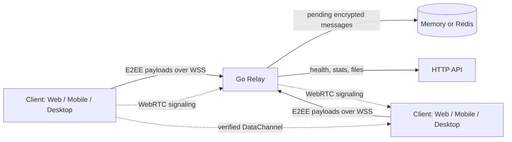

# CipherNode

Accountless self-hostable E2EE messenger with Go relay, Web, Mobile and Desktop clients.

[](DOCKER.md)
[](server/go)
[](client)
[](LICENSE)
[](https://github.com/boysplaydraw/ciphernode/releases/latest)

CipherNode is a privacy-focused messenger for encrypted communication without accounts, phone numbers, or a hosted SaaS dependency. Clients generate local cryptographic identities, exchange encrypted messages through a small Go relay, and can optionally attempt direct WebRTC transport while keeping relay fallback available.

## Features

- Accountless local identity with no email or phone-number registration.
- End-to-end encrypted direct and group messages.
- Go WebSocket relay for delivery, presence, file notices, and WebRTC signaling.
- Web, React Native mobile, and Tauri desktop targets.
- Docker deployment for self-hosting behind Caddy or another reverse proxy.
- Optional Tor/.onion deployment paths.
- Optional WebRTC P2P transport with relay fallback.
- File sharing with relay routing by default and P2P only after verified readiness.
- Startup diagnostics, transport logs, health checks, and relay metrics.

## Architecture



Relay is the default transport. P2P is an opportunistic upgrade and is usable only when the PeerConnection is connected, the DataChannel is open, and a transport handshake has completed.

## Screenshots

Screenshots should live in `docs/screenshots/`. Recommended captures: onboarding, chat thread, group chat, network settings, and desktop window.

## Docker Deployment

```bash
git clone https://github.com/boysplaydraw/ciphernode.git
cd ciphernode
docker compose up -d
```

For HTTPS behind Caddy:

```bash
EXPO_PUBLIC_SERVER_URL=https://relay.example.com docker compose -f infra/docker/docker-compose.yml --profile proxy up -d
```

## VPS Deployment

1. Point DNS such as `relay.example.com` to the VPS.
2. Install Docker and Docker Compose.
3. Start the relay/web stack with `EXPO_PUBLIC_SERVER_URL=https://relay.example.com`.
4. Put Caddy, nginx, or another proxy in front of port `5000`.
5. Verify `https://relay.example.com/health` and `wss://relay.example.com/ws`.

## Security Model

- Private keys are generated and stored on the client.
- The relay stores and forwards encrypted payloads; it is not trusted with plaintext.
- The relay can observe delivery metadata: timing, IP address, online state, recipient IDs, and payload sizes.
- Tor and self-hosting reduce network and infrastructure trust but do not remove endpoint risk.
- WebRTC can expose network metadata; it is disabled while Tor mode is enabled.

## Threat Model

CipherNode protects message contents from the relay operator and passive network observers when HTTPS/WSS is used. It does not protect against compromised devices, malicious contacts, screenshots by recipients, traffic correlation by powerful adversaries, or a relay that withholds, delays, or deletes encrypted messages. See [THREAT_MODEL.md](THREAT_MODEL.md).

## Transport Modes

- `relay`: default path for messages, media notices, file metadata, and signaling.
- `p2p_connecting`: WebRTC negotiation is in progress; UI remains on Relay/Offline.
- `p2p_ready`: PeerConnection connected, DataChannel open, handshake complete.
- `p2p_failed`: timeout, channel close, connection failure, or handshake mismatch; relay fallback remains active when available.

## Troubleshooting

- Android APK opens then closes: verify `EXPO_PUBLIC_SERVER_URL` is set for production builds and check diagnostics stored under `@ciphernode/startup_diagnostics`.
- WebSocket fails: confirm `/health` works over HTTPS and `/ws` upgrades to WSS through the proxy.
- P2P never becomes ready: keep relay mode active and check transport logs for state transitions.
- Media fails in P2P mode: relay is the default route; P2P media is used only after transport readiness.

## Roadmap

- Native WebRTC dependency and EAS config for Android/iOS P2P.
- Persistent encrypted storage backend for relay queues.
- Prometheus metrics endpoint.
- Automated crash report upload hook.
- Reproducible desktop and mobile releases.
- Hardened contact verification and safety-number UX.

---

**Uçtan uca şifreli, hesap gerektirmeyen, kendi relay sunucunuzla çalışabilen açık kaynak mesajlaşma uygulaması.**

[](https://github.com/boysplaydraw/ciphernode/releases/latest)
[](LICENSE)
[](https://github.com/boysplaydraw/ciphernode/releases)
[](https://github.com/boysplaydraw/ciphernode/commits/master)

---

## İndir

| Platform | Dosya | Açıklama |
|----------|-------|----------|
| **Windows** | [CipherNode Setup 1.0.0.exe](https://github.com/boysplaydraw/ciphernode/releases/latest/download/CipherNode.Setup.1.0.0.exe) | Kurulum paketi (önerilen) |
| **Windows** | [CipherNode 1.0.0.exe](https://github.com/boysplaydraw/ciphernode/releases/latest/download/CipherNode.1.0.0.exe) | Taşınabilir, kurulum gerektirmez |
| **Android** | EAS Build | `npm run build:apk:production` |

---

## Özellikler

- **Hesap gerektirmez** — Kimlik = yerel olarak üretilen kriptografik anahtar (XXXX-XXXX formatı)
- **Uçtan uca şifreleme** — OpenPGP (AES-256 + RSA) ile tam şifreleme
- **Tor/.onion desteği** — Varsayılan HTTPS relay; Tor Browser/Orbot veya harici hidden service ile opsiyonel ağ gizliliği
- **Grup sohbetleri** — Şifreli çok kullanıcılı grup mesajlaşması
- **Kaybolan mesajlar** — Seçilebilir süre sonunda otomatik silinen mesajlar
- **Büyük dosya transferi** — ≤100MB relay, >100MB P2P chunk aktarımı (5GB'a kadar)
- **Gizlilik modülleri** — Ekran koruması, biyometrik kilit, metadata temizleme, steganografi, hayalet mod
- **QR kod ile kişi ekleme** — Android'de kamera ile anlık kişi ekleme
- **Kendi sunucunu kur** — Docker, Termux veya herhangi bir Linux/Windows sunucusunda çalışır
- **HTTPS/SSL** — Docker Caddy profiliyle domain varsa otomatik HTTPS, domain yoksa HTTP/IP ile yerel veya LAN kullanım
- **Uygulamayı sıfırla** — Ayarlar'dan tek tuşla tüm veriyi sil ve başa dön

---

## Mimari

### Teknoloji Yığını

| Katman | Teknoloji |
|--------|-----------|
| Mobil / Masaüstü | React Native + Expo (Android, Windows/Electron, Web) |
| Backend | Go relay server + WebSocket |
| Şifreleme | openpgp.js (OpenPGP uyumlu) |
| Gerçek zamanlı | WebSocket relay |
| Depolama | AsyncStorage (mobil), localStorage (masaüstü) |

### Proje Yapısı

```
.
├── client/                 # React Native/Expo ön yüz
│   ├── screens/            # Uygulama ekranları
│   ├── components/         # Yeniden kullanılabilir bileşenler
│   ├── lib/                # Yardımcılar (crypto, storage, socket)
│   ├── hooks/              # Custom React hook'ları
│   ├── constants/          # Tema, dil, ayarlar
│   └── navigation/         # React Navigation yapısı
├── server/go/              # Go relay backend
│   ├── cmd/ciphernode-server
│   └── internal/           # API, WebSocket, storage, security
├── electron/               # Masaüstü (Electron) ana süreç
│   ├── main.ts             # IPC, Tor yönetimi, güncelleme
│   ├── preload.ts          # Güvenli köprü (contextBridge)
│   └── tor-manager.ts      # Yerleşik Tor süreci
├── scripts/                # Kurulum scriptleri
│   ├── setup-ssl.sh        # Linux Let's Encrypt kurulumu
│   └── setup-ssl-windows.ps1  # Windows win-acme SSL kurulumu
├── docker-compose.yml      # Docker yapılandırması
└── Dockerfile              # Web build + Go runtime image
```

---

## Geliştirme

### Gereksinimler

- Node.js 20+
- npm
- Expo CLI (mobil geliştirme için)

### Kurulum

```bash
git clone https://github.com/boysplaydraw/ciphernode.git
cd ciphernode
npm install
```

### Geliştirme Sunucusu

```bash
# Terminal 1 — Go relay backend (port 5000)
npm run go:server:dev

# Terminal 2 — Expo geliştirme sunucusu
npx expo start
```

### Build

```bash
# Go server
npm run go:server:test

# Web (Expo export)
npm run electron:build:web

# Electron (Windows)
npm run electron:win

# Android APK (EAS)
npm run build:apk:production
```

---

## Sunucu Kurulumu

### Docker (Önerilen)

```bash
# Tek paket Docker imajı — web + server aynı container içinde
git clone https://github.com/boysplaydraw/ciphernode.git
cd ciphernode
docker compose up -d
```

Web `http://sunucu-ip:5000/app`, API `http://sunucu-ip:5000` adresinde çalışır.

**Domain varsa Caddy ile otomatik HTTPS:**
```bash
set CADDY_SITE_ADDRESS=relay.example.com
set EXPO_PUBLIC_SERVER_URL=https://relay.example.com
docker compose -f infra/docker/docker-compose.yml --profile proxy up -d
```

### Linux (Manuel)

```bash
# Go relay olarak başlat
cd server/go
go run ./cmd/ciphernode-server
```

### Windows

```powershell
# Geliştirme — HTTP
powershell -File scripts\windows-start.ps1

# Üretim — SSL (win-acme ile Let's Encrypt)
powershell -File scripts\windows-start.ps1 -Mode ssl -SslDomain relay.example.com

# Tünel ile (domain olmadan, otomatik HTTPS)
powershell -File scripts\windows-start.ps1 -Mode cloudflare
powershell -File scripts\windows-start.ps1 -Mode ngrok
```

### Termux (Android Terminal Emulator)

```bash
pkg install -y nodejs tar
tar -xzf ciphernode-termux.tar.gz
cd ciphernode-termux
bash termux-start.sh
```

Termux bir Android terminal emulatorudur. Paket bu terminal ortamında rootsuz çalışır; varsayılan port `5000` olduğu için Android'de özel yetki gerekmez.

---

## Tor Kurulumu

### Android (Orbot)
1. [Orbot](https://play.google.com/store/apps/details?id=org.torproject.android)'u Play Store'dan yükleyin
2. "Tüm Uygulamalar için VPN" modunu etkinleştirin
3. CipherNode'u açın → Ayarlar → Tor → etkinleştirin

### Web / Desktop
Web uygulamasında Tor için Tor Browser kullanın. Desktop paketinde Tor desteği varsa Ayarlar → Tor Bağlantısı üzerinden yönetilir; paketlenmemiş geliştirme build'lerinde harici Tor proxy gerekir.

### Sunucu .onion adresi
Docker image Tor daemon çalıştırmaz. Host üzerinde Tor hidden service kurup web/API portlarını relay'e yönlendirin, sonra `.env` veya compose ortamında `ONION_ADDRESS=abc123...xyz.onion` ayarlayın. Backend bu adresi `GET /api/onion-address` ile döner ve uygulama Ağ Ayarları ekranında gösterir.

---

## Gizlilik ve Güvenlik

### Kimlik Sistemi

Kullanıcılar PGP açık anahtarının SHA-256 karması ile tanımlanır (`XXXX-XXXX` formatı):
- Kişisel bilgi toplanmaz
- Kayıt, e-posta, telefon numarası gerekmez
- Kimlik tamamen kriptografik

### Mesaj Şifreleme

1. Mesajlar gönderilmeden önce **alıcının açık anahtarıyla** şifrelenir (RSA)
2. Şifreli yük **AES-256** ile ek katman şifreleme alır
3. Sunucu yalnızca şifreli veriyi görür, içeriği okuyamaz
4. Şifre çözme yalnızca alıcı cihazında gerçekleşir

### Gizlilik Modülleri

| Modül | Açıklama |
|-------|----------|
| Ekran Koruması | Ekran görüntüsü ve kaydı engeller |
| Biyometrik Kilit | Parmak izi / yüz ile kilit |
| Metadata Temizleme | Görsel paylaşımında EXIF verilerini siler |
| Steganografi Modu | Mesajları görünmez Unicode karakterlere gömer |
| Hayalet Mod | Yazıyor göstergesi ve okundu bilgisini gizler |
| Sadece P2P | Mesajları yalnızca alıcı çevrimiçiyken iletir |

---

## Ortam Değişkenleri

```env
# Temel sunucu ayarları
PORT=5000
HOST=0.0.0.0

# Mesaj & dosya ayarları
MESSAGE_TTL=24h                # Mesaj yaşam süresi
FILE_TTL=24h                   # Dosya yaşam süresi
RATE_LIMIT_PER_MINUTE=120      # İstemci başına hız limiti
MAX_FILE_SIZE_MB=100           # Maksimum dosya boyutu
MAX_FILE_DOWNLOADS=10          # Dosya indirme limiti

# Uygulama
CORS_ALLOWED_ORIGINS=          # İsteğe bağlı origin allowlist
ONION_ADDRESS=abc123...xyz.onion # isteğe bağlı; harici Tor hidden service adresi
```

---

## API

### HTTP Endpoint'leri

| Endpoint | Açıklama |
|----------|----------|
| `GET /api/health` | Sunucu sağlık kontrolü |
| `GET /api/users/:id/publickey` | Açık anahtar sorgula |
| `GET /api/contacts/:userId` | Kişi listesini çek |
| `POST /api/contacts/:userId` | Kişi listesini güncelle |
| `GET /api/onion-address` | .onion adresi sorgula |

### WebSocket Olayları

| Olay | Açıklama |
|------|----------|
| `register` | Kullanıcı kimliği kaydet |
| `message` | Şifreli mesaj gönder |
| `typing` | Yazıyor göstergesi |
| `read` | Okundu bildirimi |
| `group:message` | Grup mesajı |

---

## Katkıda Bulunma

1. Fork'layın
2. Feature branch oluşturun (`git checkout -b feature/ozellik`)
3. Değişikliklerinizi commit'leyin
4. Push'layın ve Pull Request açın

```bash
npm run lint        # Kod kalitesi kontrolü
npm run format      # Prettier ile biçimlendirme
npm run check:types # TypeScript tip kontrolü
```

---

## Güvenlik Bildirimi

Güvenlik açıkları için GitHub Issues **kullanmayın**. Lütfen doğrudan `support@cipher-node.site` ile iletişime geçin.

---

## Lisans

**GNU General Public License v3.0** — Ayrıntılar için [LICENSE](LICENSE) dosyasına bakın.

Tüm türev çalışmalar aynı GPLv3 lisansı altında açık kaynak olarak dağıtılmalıdır.

---

## Yasal Uyarı

CipherNode aktif geliştirme aşamasındadır. Güvenlik öncelikli olarak tasarlanmış olsa da hiçbir yazılım %100 güvenli değildir. Üretim ortamında kullanmadan önce kendi güvenlik denetiminizi yapın.

---

*Son güncelleme: Nisan 2026*
## Go/Tauri Migration Status

This repository contains the Go WebSocket relay backend and a Tauri desktop scaffold:

```text
apps/
  mobile/
  web/
  desktop/
server/
  go/
packages/
  crypto/
  shared/
infra/
  docker/
```

The Docker image uses the Go relay and exposes raw WebSocket at `/ws`.

### Go Backend

```bash
cd server/go
go test ./...
go run ./cmd/ciphernode-server
```

Endpoints:

- `GET /health`
- `GET /api/health`
- `GET /api/stats`
- `GET /api/users/:userId/publickey`
- `POST /api/files/upload`
- `GET /api/files/:fileId`
- `GET /api/files/:fileId/info`
- `GET /ws`

Environment examples:

```bash
PORT=5000
HOST=0.0.0.0
MESSAGE_TTL=24h
FILE_TTL=24h
RATE_LIMIT_PER_MINUTE=120
MAX_FILE_SIZE_MB=100
```

### Tauri Desktop

```bash
cd apps/desktop
npm install
npm run dev
```

The Tauri shell loads the existing Expo Web frontend and exposes native command placeholders for `start_tor`, `stop_tor`, `get_tor_status` and `configure_proxy`. Electron remains in the repo until the Tauri command bridge reaches feature parity.

### Docker Self-Host

```bash
docker compose -f infra/docker/docker-compose.yml up --build
```

Services include `go-server`, `web`, optional `redis` profile and optional `reverse-proxy` profile.

### Security Model

The server is relay-only. E2EE stays on the client; the Go backend stores or forwards encrypted payloads and metadata only. No external audit has been completed. See `THREAT_MODEL.md`, `SECURITY.md` and `docs/e2ee-flow.md`.

### Migration Roadmap

- Complete Socket.IO feature parity in the Go WebSocket protocol, including full matching-session behavior.
- Replace direct `socket.io-client` usage with `packages/shared` transport adapters.
- Move client crypto helpers into `packages/crypto`.
- Replace Electron IPC calls with a desktop bridge that supports Tauri `invoke`.
- Add Redis-backed storage implementation and integration tests.
